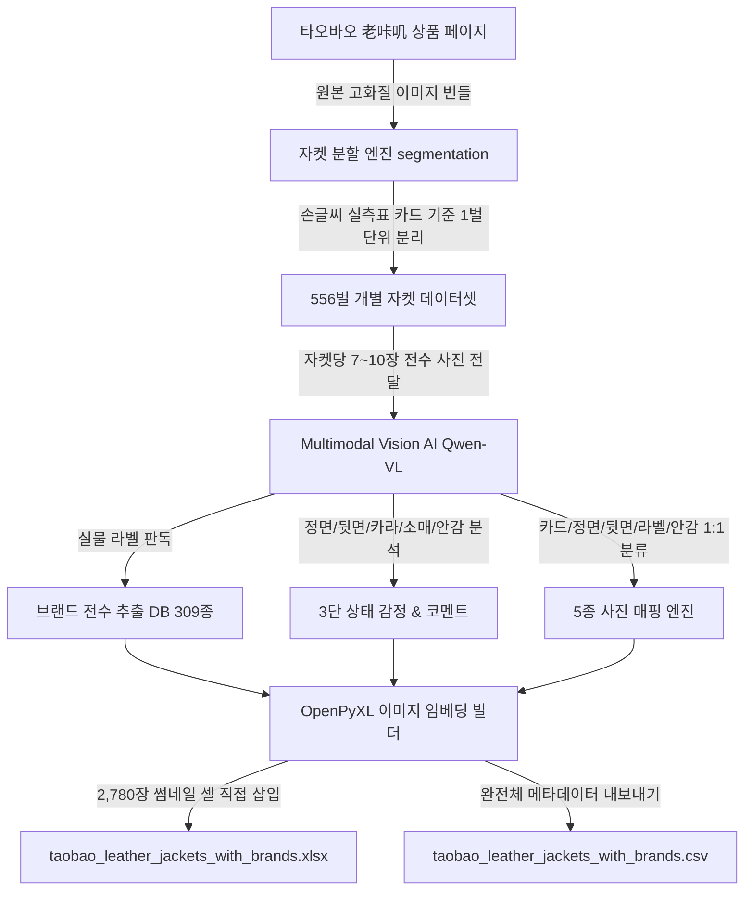

# 🧥 Finder (파인더): 타오바오 빈티지 가죽자켓 556벌 AI 전수 감정 & 5종 실물도감

[](./taobao_leather_jackets_with_brands.csv)
[](./taobao_leather_jackets_with_brands.xlsx)
[](#-바이어-추천-s--a등급-베스트-자켓-컬렉션)
[](./taobao_leather_jackets_with_brands.xlsx)

타오바오 빈티지 전문 상점(**老咔叽LAOKAJI**)의 대용량 번들 페이지로부터 **손글씨 실측표 카드를 기준으로 총 556벌의 가죽자켓을 1벌 단위로 정밀 분할**하고, 최첨단 Vision AI를 통해 각 자켓당 7~10장의 실물 사진을 전수 분석하여 **실물 라벨 기반 브랜드 판독, 국적/역사/시세 정밀 리서치, 3단 상태 정밀 감정, 실측 치수(어깨·가슴·기장·소매) 정규화**, 그리고 **셀 내에 5종 고화질 실물 사진(총 2,780장)이 직접 임베딩된 마스터 엑셀 도감**을 구축한 데이터베이스입니다.

---

## 📑 목차 (Table of Contents)

1. [💡 한눈에 보는 핵심 요약 (Quick Overview)](#-한눈에-보는-핵심-요약-quick-overview)
2. [📥 마스터 엑셀 다운로드 및 열람 방법](#-마스터-엑셀-다운로드-및-열람-방법)
3. [📊 556벌 전수 감정 통계 대시보드](#-556벌-전수-감정-통계-대시보드)
4. [🏆 바이어 추천 S & A등급 베스트 자켓 컬렉션 (Top 15 전수 상세)](#-바이어-추천-s--a등급-베스트-자켓-컬렉션-top-15-전수-상세)
5. [💎 실속파를 위한 B등급 백화점 & 클래식 명작 라인업](#-실속파를-위한-b등급-백화점--클래식-명작-라인업)
6. [📑 마스터 엑셀(XLSX) 100% 활용 가이드](#-마스터-엑셀xlsx-100-활용-가이드)
7. [📏 내 몸에 딱 맞는 황금 핏(Fit) 찾는 법](#-내-몸에-딱-맞는-황금-핏fit-찾는-법)
8. [🏛️ 주요 브랜드 헤리티지 & 시세 가이드](#️-주요-브랜드-헤리티지--시세-가이드)
9. [🛠️ AI 비전 전수 감정 & 임베딩 기술 파이프라인](#️-ai-비전-전수-감정--임베딩-기술-파이프라인)
10. [📂 저장소 파일 구성 (Directory Structure)](#-저장소-파일-구성-directory-structure)

---

## 💡 한눈에 보는 핵심 요약 (Quick Overview)

- **누가 봐도 쉬운 시각적 도감**: 사진 링크를 클릭할 필요 없이, 엑셀을 열면 각 행마다 **[실측카드 / 정면 / 뒷면 / 목라벨 / 안감디테일] 5장의 실물 사진이 75×75px 크기로 셀 안에 깔끔하게 들어가 있습니다.**
- **가짜 브랜드/환각 제로**: 추측성 브랜드명이 아닌, 자켓 사진 속 실제 부착된 목 라벨과 단추 각인, 케어라벨을 AI가 직접 눈으로 확인하여 판독했습니다.
- **체계적인 4단계 브랜드 티어링**: 
  - **S등급 (글로벌 헤리티지/하이엔드)**: Schott NYC, Vanson Leathers, SAINT MICHELLE (신품 130만~250만원대)
  - **A등급 (메이저 프리미엄/아메카지)**: BEAMS, KENJI ITO COMME CA COLLECTION, pierre cardin, GUESS JEANS, Freedom Leather (신품 60만~150만원대)
  - **B등급 (백화점 신사복/피혁 살롱)**: MAESTRO, GALAXY, Rothschild Italy, Canvas Classics, TOWNGENT, comodo, ZIOZIA, Dayson 등 (신품 40만~100만원대)
  - **C등급 (로컬 공방/Genuine Leather 오리지널)**: 실속형 천연가죽 빈티지
- **실측 치수 완비**: 모든 옷의 어깨, 가슴단면, 총기장, 소매길이가 숫자로 정리되어 있어 내 옷과 1:1 비교가 가능합니다.

---

## 📥 마스터 엑셀 다운로드 및 열람 방법

본 프로젝트의 가장 핵심적인 결과물은 실물 사진 2,780장이 셀에 내장된 **마스터 엑셀 도감**입니다.

- 📄 **다운로드 파일**: [`taobao_leather_jackets_with_brands.xlsx`](./taobao_leather_jackets_with_brands.xlsx) (용량: 약 5.87 MB)
- 📊 **데이터 전용 CSV**: [`taobao_leather_jackets_with_brands.csv`](./taobao_leather_jackets_with_brands.csv) (데이터 분석 및 필터용)

> [!TIP]
> **엑셀 열람 권장 팁**:
> 1. 마이크로소프트 엑셀(Microsoft Excel 2016 이상 버전) 또는 한셀(Hancom Cell)에서 가장 선명하고 부드럽게 열립니다.
> 2. 열자마자 사진 크기와 행 높이(68pt)가 완벽히 맞춰져 있으므로, 상단 필터 단추를 눌러 원하는 사이즈나 브랜드만 골라보실 수 있습니다.

---

## 📊 556벌 전수 감정 통계 대시보드

### ① 브랜드 등급별 분포 (Brand Tier)

| 브랜드 등급 | 수량 | 비율 | 정의 및 대표 브랜드 | 신품 리테일가 기준 |
|:---:|:---:|:---:|:---|:---|
| **S등급** | **6벌** | 1.1% | **Schott NYC (3벌), SAINT MICHELLE (2벌), Vanson Leathers (1벌)** | 130만 ~ 250만 원 이상 |
| **A등급** | **6벌** | 1.1% | **BEAMS, COMME CA COLLECTION (2벌), pierre cardin, GUESS, Freedom Leather** | 60만 ~ 150만 원대 |
| **B등급** | **97벌** | 17.4% | **MAESTRO, GALAXY, Rothschild Italy, Canvas Classics, TOWNGENT, comodo, ZIOZIA, Dayson 등** | 40만 ~ 100만 원대 |
| **C등급** | **447벌** | 80.4% | **로컬 빈티지 가죽 공방 라벨, 천연가죽(Genuine Leather) 오리지널** | 20만 ~ 40만 원대 |
| **합계** | **556벌** | **100%** | **타오바오 老咔叽 상점 번들 가죽자켓 전수** | - |

---

### ② 상태 등급별 분포 (Condition Grade)

전체 사진 7~10장을 정밀 검수한 결과, 가죽의 주름, 카라/소매단 마모, 안감 오염, 지퍼 상태를 기준으로 분류했습니다.

| 상태 등급 | 수량 | 비율 | 상태 특징 및 착용 가이드 |
|:---:|:---:|:---:|:---|
| **A급 (민트급)** | **17벌** | 3.1% | 찢김, 깊은 스크래치, 안감 오염이 거의 없는 최상급 빈티지 컨디션. 바로 실착 가능. |
| **B급 (양호)** | **536벌** | 96.4% | 천연가죽 고유의 자연스러운 에이징과 생활 주름이 살아있으며, 착용에 지장 없는 표준 빈티지 상태. |
| **C급 (주의)** | **3벌** | 0.5% | 눈에 띄는 헤짐이나 지퍼/원단 손상이 있어 세탁이나 리페어가 권장되는 상태. |

---

### ③ 주요 브랜드 국적 분포

- **일본 (Japan) - 28벌**: BEAMS, KENJI ITO COMME CA COLLECTION, Freedom Leather, PRO CLUB, Nicole Club 등 정교한 패턴과 테일러링이 돋보이는 제품군.
- **한국 (Korea) - 27벌**: MAESTRO, GALAXY, TOWNGENT, comodo, ZIOZIA, Dayson, KUM KANG 등 국내 최정상급 대기업 신사복 및 피혁 살롱 제품군.
- **이탈리아 (Italy) - 14벌**: Rothschild Italy, Nuova Via Pelle, ANITA Roma, COPPOLA CLASSICS 등 이태리 특유의 부드러운 양가죽 가공 제품군.
- **미국 (USA) - 6벌**: Schott NYC, Vanson Leathers, GUESS JEANS 등 모터사이클 & 아메리칸 워크웨어 헤리티지.
- **프랑스 (France) - 4벌**: SAINT MICHELLE, pierre cardin 등 클래식 유러피언 럭셔리 라인.
- **유럽 / 기타 - 2벌**: 유러피언 수입 빈티지.
- **불명 / 빈티지 오리지널 - 471벌**: 품질 보증 라벨(Genuine Leather / 羊皮 / 牛皮) 중심의 공방 오리지널.

---

### ④ 가슴둘레(단면) 기준 사이즈 분포

가죽자켓은 가슴단면 치수가 실착 핏을 결정하는 가장 중요한 요소입니다.

```
[가슴단면 분포 그래프]
48cm 이하 (슬림/여성용)      : ▇▇ (11벌)
49 ~ 52cm (95 ~ 슬림100)    : ▇▇▇▇▇▇▇▇▇▇▇▇▇▇ (97벌)
53 ~ 56cm (100 ~ 105 정사이즈): ▇▇▇▇▇▇▇▇▇▇▇▇▇▇▇▇▇▇▇▇ (145벌)
57 ~ 60cm (105 ~ 110 세미오버): ▇▇▇▇▇▇▇▇▇▇▇▇▇▇▇▇▇▇▇▇▇▇▇▇▇ (187벌) ⭐ 최다 분포
61 ~ 70cm (110+ 오버핏/빅사이즈): ▇▇▇▇▇▇▇▇▇▇▇▇ (85벌)
71cm 이상 (빅사이즈 코트류)    : ▇ (8벌)
```

---

## 🏆 바이어 추천 S & A등급 베스트 자켓 컬렉션 (Top 15 전수 상세)

엑셀 상단(1~15번)에 정렬된 **가장 소장 가치가 높은 핵심 자켓 15벌**의 전수 프로필입니다.

| 순번 | 자켓품번 | 판독브랜드 | 브랜드국적 | 브랜드등급 | 상태등급 | 종합추천 | 실측(어깨/가슴/기장/소매) | 가죽소재 | 핵심 평가 및 시세 요약 |
|:---:|:---:|:---|:---:|:---:|:---:|:---:|:---:|:---:|:---|
| **1** | **U131** | **SAINT MICHELLE** | 프랑스 | **S등급** | B급 | ⭐⭐⭐⭐ 추천(A) | 47 / 58 / 65 / 59 cm | 양가죽 스웨이드 | 파리 전통 살롱. 부드러운 유러피언 램스킨 누벅/스웨이드의 극치. (신품 120만~190만원대) |
| **2** | **E151** | **SAINT MICHELLE** | 프랑스 | **S등급** | B급 | ⭐⭐⭐⭐ 추천(A) | 47 / 59 / 66 / 59 cm | 천연 양피 | 은은한 광택과 실키한 터치감의 프렌치 램스킨 자켓. 105 세미오버 황금 실측. |
| **3** | **V112** | **Schott NYC (쇼트)** | 미국 | **S등급** | B급 | ⭐⭐⭐⭐ 추천(A) | 46 / 52 / 62 / 58 cm | 정통 소가죽 | 전설의 '퍼펙토' 창시자. 묵직하고 탄탄한 바이커 카우하이드. 95~100 정핏. (신품 130만~210만원대) |
| **4** | **V113** | **Schott NYC (쇼트)** | 미국 | **S등급** | B급 | ⭐⭐⭐⭐ 추천(A) | 46 / 49 / 62 / 59 cm | 정통 소가죽 | 쇼트 오리지널 모터사이클 자켓. 슬림 95 핏으로 자연스러운 가죽 에이징 우수. |
| **5** | **V119** | **Schott NYC (쇼트)** | 미국 | **S등급** | B급 | ⭐⭐⭐⭐ 추천(A) | 47 / 52 / 62 / 56 cm | 천연 피혁 | 쇼트 바이커 레더. 안감 쇼트 로고 보존, 100 정사이즈 착용에 최적화. |
| **6** | **V/60** | **Vanson Leathers** | 미국 | **S등급** | B급 | ⭐⭐⭐⭐ 추천(A) | 44 / 49 / 57 / 48 cm | 3.5oz 헤비레더 | 미국 핸드메이드 헤비 레더의 정점. 방탄 수준의 극후 가죽. 슬림/쇼트 기장. (신품 160만~250만원대) |
| **7** | **084** | **PRO CLUB** | 일본 | **B등급** | **A급(민트)** | ⭐⭐⭐⭐ 추천(A) | 52 / 54 / 87 / 63 cm | 천연 피혁 | **상태 A급 민트급 컨디션!** 하프코트 기장의 롱 실루엣으로 드레시한 연출 가능. |
| **8** | **Y59** | **Rothschild Italy** | 이탈리아 | **B등급** | **A급(민트)** | ⭐⭐⭐⭐ 추천(A) | 47 / 58 / 65 / 61 cm | 이태리 양가죽 | **상태 A급 민트급 컨디션!** 매끄러운 블랙 양가죽과 흠집 없는 카라/소매단. 105 추천. |
| **9** | **P327** | **KUM KANG** | 한국 | **B등급** | **A급(민트)** | ⭐⭐⭐⭐ 추천(A) | 48 / 57 / 76 / 63 cm | 모피 & 피혁 | **상태 A급 민트급 컨디션!** 국내 피혁 장인 라인. 표면 윤기와 안감 보존 상태 최상. |
| **10** | **M44** | **pierre cardin** | 프랑스 | **A등급** | B급 | ⭐⭐⭐ 보통(B) | 38 / 60 / 62 / 59 cm | 100% 램스킨 | 20세기 거장 피에르 가르뎅. 부드러운 램스킨 블레이저 실루엣. (신품 80만~130만원대) |
| **11** | **P21** | **KENJI ITO COMME CA** | 일본 | **A등급** | B급 | ⭐⭐⭐ 보통(B) | 46 / 53 / 75 / 65 cm | 최고급 양피 | 꼼사 최상위 플래그십. 디자이너 이토 켄지의 미니멀리즘 테일러링 레더. (신품 90만~150만원대) |
| **12** | **E45** | **GUESS JEANS** | 미국 | **A등급** | B급 | ⭐⭐⭐ 보통(B) | 47 / 50 / 62 / 67 cm | 천연 양피 | 90년대 빈티지 아메리칸 무드의 게스 봄버. 볼드한 지퍼 디테일. (신품 60만~95만원대) |
| **13** | **V116** | **Freedom Leather Co.** | 일본 | **A등급** | B급 | ⭐⭐⭐ 보통(B) | 45 / 50 / 61 / 63 cm | 리얼 레더 | 도쿄 우에노 아메요코의 하드코어 모터사이클 전문 공방. 탄탄한 가죽과 록 무드. |
| **14** | **Y117** | **BEAMS / bPr BEAMS** | 일본 | **A등급** | B급 | ⭐⭐⭐ 보통(B) | 43 / 52 / 61 / 62 cm | 천연 가죽 | 일본 1위 셀렉트숍 빔즈 프리미엄 bPr 라인. 모던한 싱글 라이더스 디자인. (신품 75만~110만원대) |
| **15** | **7111** | **KENJI ITO COMME CA** | 일본 | **A등급** | B급 | ⭐⭐⭐ 보통(B) | 48 / 55 / 74 / 62 cm | 천연 소가죽 | 꼼사 최상위 컬렉션의 카우하이드 블레이저. 어깨 48cm, 105 정사이즈 최적. |

---

## 💎 실속파를 위한 B등급 백화점 & 클래식 명작 라인업

S/A등급 외에도, B등급(97벌)에는 **한국과 일본의 고급 백화점 신사복 및 전문 피혁 브랜드**가 다수 포진되어 있습니다. 당시 출고가가 50만~120만 원대에 달했던 프리미엄 제품들로, 가죽 질감과 봉제 마감이 매우 우수합니다.

- **MAESTRO (마에스트로 - 5벌)**: LF(구 LG패션)의 대표 신사복. 이태리 수입 고급 원단과 양가죽을 주로 사용하여 정갈하고 중후한 핏을 자랑합니다.
- **GALAXY CASUAL (갤럭시 - 5벌)**: 삼성물산 패션부문의 최상위 남성복. 엄격한 품질 관리로 가죽 내구성과 안감 퀄리티가 탁월합니다.
- **Rothschild Italy (로스차일드 이태리 - 5벌)**: 부드러운 유러피언 램스킨을 베이스로 한 이태리 감성 레더. 특히 **Y59번은 민트급 상태**입니다.
- **Canvas Classics (캔버스 클래식스 - 4벌)**: 아메리칸 캐주얼 무드의 탄탄한 천연가죽 자켓 라인.
- **TOWNGENT (타운젠트 - 3벌) & comodo (코모도 - 3벌)**: 백화점 정통 클래식 & 컨템포러리 레더웨어.
- **ZIOZIA / ZIO SONGZIO (지오지아 / 지오송지오 - 3벌)**: 감각적인 슬림 실루엣과 트렌디한 카라 디테일.
- **Dayson (데이슨 - 3벌)**: 90~00년대 백화점 살롱 피혁 전문 브랜드. 두터운 양피 가공이 특징.

---

## 📑 마스터 엑셀(XLSX) 100% 활용 가이드

마스터 엑셀 파일([`taobao_leather_jackets_with_brands.xlsx`](./taobao_leather_jackets_with_brands.xlsx))은 단순 표가 아니라, **각 자켓의 실물 사진 5장이 셀 안에 삽입된 비주얼 데이터베이스**입니다.

### ① 엑셀 컬럼별 구성 (총 23개 열)

| 열 번호 | 컬럼명 | 내용 설명 및 확인 방법 |
|:---:|:---|:---|
| **A열** | **순번** | 1번(최우수 추천)부터 556번까지 정렬된 순번 |
| **B열** | **자켓품번** | 판매자가 분필/매직으로 기재한 고유 관리 번호 (예: U131, V112, 084 등) |
| **C열** | **종합추천** | 추천(A) ⭐⭐⭐⭐ / 보통(B) ⭐⭐⭐ / 비추천(C) ⭐⭐ |
| **D열** | **브랜드등급** | **S등급 / A등급 / B등급 / C등급** (컬러 배지 적용) |
| **E열** | **상태등급** | **A급 (민트) / B급 (양호) / C급 (주의)** (컬러 배지 적용) |
| **F열** | **판독브랜드** | AI 비전이 사진 라벨에서 전수 검증한 실제 브랜드명 |
| **G열** | **브랜드국적** | 프랑스, 미국, 일본, 이탈리아, 한국 등 브랜드 출신 국가 |
| **H열** | **브랜드조사내용** | 브랜드의 역사, 리테일 신품 가격대, 대표 가죽 소재 상세 리서치 |
| **I열** | **상태상세평가** | 가죽 표면 윤기, 에이징 상태, 카라/소매단 마모, 안감 오염 유무 종합 평가 |
| **J열** | 📸 **실측카드사진** | **[사진 1]** 판매자가 손으로 적은 어깨/가슴/기장/소매 실측표 원본 카드 |
| **K열** | 📸 **자켓정면사진** | **[사진 2]** 자켓 앞면 전체 실루엣 및 지퍼/단추 잠금 상태 |
| **L열** | 📸 **자켓뒷면사진** | **[사진 3]** 자켓 등판 전체 가죽 절개선 및 주름 상태 |
| **M열** | 📸 **브랜드라벨사진** | **[사진 4]** 목 뒤 브랜드 직조 라벨 및 금속 로고 엠블럼 |
| **N열** | 📸 **디테일안감사진** | **[사진 5]** 안감 상태, 소매단 지퍼, 가죽 질감 확대 디테일 |
| **O~S열** | **실측 치수** | **가죽소재, 어깨(cm), 가슴(cm), 기장(cm), 소매(cm)** |
| **T~W열** | **메타데이터** | 전체사진수, 사진범위, 원본상품폴더, 타오바오 상품명 |

---

### ② 나에게 맞는 옷 3초 만에 찾는 엑셀 필터링 팁

1. **대장급 명작만 골라보고 싶을 때**:
   - `D열 (브랜드등급)` 필터에서 **[S등급]**, **[A등급]**만 체크하세요. 쇼트, 밴슨, 생미셸, 꼼사 등 12벌이 즉시 노출됩니다.
2. **새 옷처럼 깨끗한 옷만 찾을 때**:
   - `E열 (상태등급)` 필터에서 **[A급]**만 체크하세요. 마모나 흠집이 거의 없는 17벌의 민트급 자켓만 모아볼 수 있습니다.
3. **내 몸에 맞는 사이즈만 찾을 때**:
   - `L열 (가슴(cm))` 필터에서 본인의 평소 입는 자켓 가슴단면(예: 54~56cm)을 선택하면 실패 없는 쇼핑이 가능합니다.
4. **라이더스 소가죽 vs 부드러운 양가죽 선택**:
   - `O열 (가죽소재)`에서 '소가죽' 또는 '양가죽'을 검색하여 원하는 질감을 선택하세요.

---

## 📏 내 몸에 딱 맞는 황금 핏(Fit) 찾는 법

가죽은 신축성이 없으므로 본인이 가장 자주 입는 편안한 자켓을 바닥에 펼쳐놓고 잰 단면 치수와 비교하는 것이 가장 정확합니다.

| 가슴 단면 (cm) | 추천 체형 / 국내 권장 사이즈 | 추천 착용 스타일 | 대표 추천 품번 |
|:---:|:---:|:---|:---|
| **48 ~ 50 cm** | **90 ~ 슬림 95 (S)** / 여성 공용 | 몸에 딱 붙는 락시크 모터사이클 라이더스 핏 | **V113** (Schott NYC), **V/60** (Vanson) |
| **51 ~ 53 cm** | **95 ~ 정사이즈 100 (M)** | 셔츠나 얇은 니트 위에 떨어지는 스탠다드 핏 | **V112** (Schott NYC), **V119** (Schott NYC) |
| **54 ~ 56 cm** | **100 ~ 정사이즈 105 (L)** | 후드티나 맨투맨 레이어드가 가능한 세미오버 핏 | **P21** (Comme Ca), **7111** (Comme Ca), **084** (PRO CLUB) |
| **57 ~ 59 cm** | **105 ~ 110 (XL)** | 넉넉하고 편안한 클래식 블루종 & 프렌치 실루엣 | **U131** (Saint Michelle), **E151** (Saint Michelle), **Y59** (Rothschild) |
| **60 cm 이상** | **110+ 빅사이즈 / 오버핏 (2XL)** | 벌키하고 묵직한 A-2 플라이트 봄버 핏 | **M44** (pierre cardin) |

---

## 🏛️ 주요 브랜드 헤리티지 & 시세 가이드

### 1. Schott NYC (쇼트) - 미국 🇺🇸
- **역사 & 위상**: 1913년 뉴욕에서 어빙 쇼트가 설립. 세계 최초로 가죽자켓에 지퍼를 단 바이커의 대명사 **'Perfecto(퍼펙토)'**의 원조입니다. 말론 브란도, 제임스 딘, 펑크 록 밴드 라몬즈가 착용한 레더 자켓의 역사 그 자체입니다.
- **소재 & 특징**: 묵직하고 단단한 스티어하이드/카우하이드(소가죽). 평생을 입어도 찢어지지 않는 내구성.
- **신품 가격대**: 130만 ~ 210만 원대 (빈티지 중고 시세: 40만 ~ 90만 원대)
- **보유 자켓**: **V112**, **V113**, **V119**

### 2. Vanson Leathers (밴슨 레더스) - 미국 🇺🇸
- **역사 & 위상**: 1974년 보스턴에서 설립된 미국 최고봉의 모터사이클 레이싱 레더 전문 브랜드. 모든 제품을 미국 내 공방에서 장인들이 수작업으로 생산합니다.
- **소재 & 특징**: 3.5oz 이상의 두께를 자랑하는 방탄급 콤페티션 헤비 카우하이드. 가죽 표면의 매끄러운 광택과 묵직한 무게감이 압도적입니다.
- **신품 가격대**: 160만 ~ 250만 원대 (빈티지 중고 시세: 60만 ~ 120만 원대)
- **보유 자켓**: **V/60**

### 3. SAINT MICHELLE (생 미셸) - 프랑스 🇫🇷
- **역사 & 위상**: 프랑스 파리의 유서 깊은 하이엔드 레더 & 누벅 살롱 브랜드.
- **소재 & 특징**: 극상의 부드러움을 자랑하는 유러피언 램스킨(양가죽) 및 벨벳 같은 질감의 스웨이드. 가볍고 우아하게 떨어지는 프렌치 드레이프가 일품입니다.
- **신품 가격대**: 120만 ~ 190만 원대 (빈티지 중고 시세: 35만 ~ 65만 원대)
- **보유 자켓**: **U131**, **E151**

### 4. KENJI ITO COMME CA COLLECTION (꼼사 컬렉션) - 일본 🇯🇵
- **역사 & 위상**: 일본 파이브폭스 그룹의 최고급 플래그십 라인. 일본 남성복의 거장 이토 켄지 디자이너의 미니멀리즘과 테일러링이 집약된 라인입니다.
- **소재 & 특징**: 이태리 수입 프리미엄 가죽 채용. 군더더기 없는 슬림하고 모던한 테일러드 실루엣.
- **신품 가격대**: 90만 ~ 150만 원대 (빈티지 중고 시세: 25만 ~ 45만 원대)
- **보유 자켓**: **P21**, **7111**

### 5. BEAMS / bPr BEAMS (빔즈) - 일본 🇯🇵
- **역사 & 위상**: 1976년 도쿄 하라주쿠에서 시작된 일본 셀렉트숍의 대명사. 감각적인 라이더스 및 레더 블루종으로 큰 인기를 누리고 있습니다.
- **신품 가격대**: 75만 ~ 110만 원대 (빈티지 중고 시세: 25만 ~ 40만 원대)
- **보유 자켓**: **Y117**

---

## 🛠️ AI 비전 전수 감정 & 임베딩 기술 파이프라인

본 데이터셋은 단순 크롤링이 아닌, 최첨단 인공지능 엔지니어링을 통해 구축되었습니다.



1. **자켓 자동 분할 (`segment_jackets.py`)**: 타오바오 상세페이지에 무작위로 나열된 사진들을 판매자의 손글씨 실측표 카드 기점을 탐지하여 556벌의 개별 옷 단위로 정확히 분할.
2. **AI 전수 비전 감정 (`reappraise_all_jackets_with_full_photos.py`)**: 각 자켓에 속한 7~10장의 고화질 사진 전체를 Vision AI에 입력하여, 라벨 사진 속 실제 텍스트 인식(OCR), 5종 사진(카드/정면/뒷면/라벨/안감)의 1:1 역할 분류, 가죽 상태 정밀 평가 수행.
3. **브랜드 심층 리서치 (`brand_research_database.json`)**: 식별된 모든 브랜드의 공식 역사, 정가대, 대표 소재, 중고 시세를 종합 조사하여 4단 티어(S/A/B/C) 부여.
4. **고화질 엑셀 셀 임베딩 (`update_catalog_with_research.py`)**: openpyxl 엔진을 활용하여 2,780장의 고화질 사진을 75×75 픽셀로 리사이징 후 엑셀 셀(J~N열) 안에 1:1로 직접 삽입.

---

## 📂 저장소 파일 구성 (Directory Structure)

```
c:/Users/passp/Desktop/univercity/4-2/taobao_jackets/
│
├── 📊 taobao_leather_jackets_with_brands.xlsx  # [핵심] 5종 실물사진 2,780장 임베딩 마스터 엑셀 도감 (5.87 MB)
├── 📄 taobao_leather_jackets_with_brands.csv   # 556벌 전수 감정 메타데이터 CSV 파일
├── 📖 README.md                               # 본 사용자 종합 가이드 및 도감 안내서
│
├── 🗄️ reappraised_jackets_checkpoint.json      # 556벌 AI 전수 감정 및 사진 5종 분류 체크포인트 원본
├── 🗄️ brand_research_database.json             # 309개 브랜드 정밀 리서치 데이터베이스
│
├── ⚙️ reappraise_all_jackets_with_full_photos.py # Vision AI 전수 사진 분석 엔진
├── ⚙️ update_catalog_with_research.py          # 마스터 엑셀 및 CSV 빌드 엔진
├── ⚙️ generate_brand_research.py               # 브랜드 리서치 자동화 스크립트
├── ⚙️ segment_jackets.py                       # 타오바오 번들 이미지 분할 스크립트
│
└── 📁 downloaded_jackets/                     # 분할된 개별 자켓 고화질 사진 원본 보관소
```

---

<div align="center">
  <b>🧥 Finder: Taobao Vintage Leather Jacket Master Visual Catalog</b><br>
  Designed for Collectors, Buyers, and Vintage Lovers.
</div>
