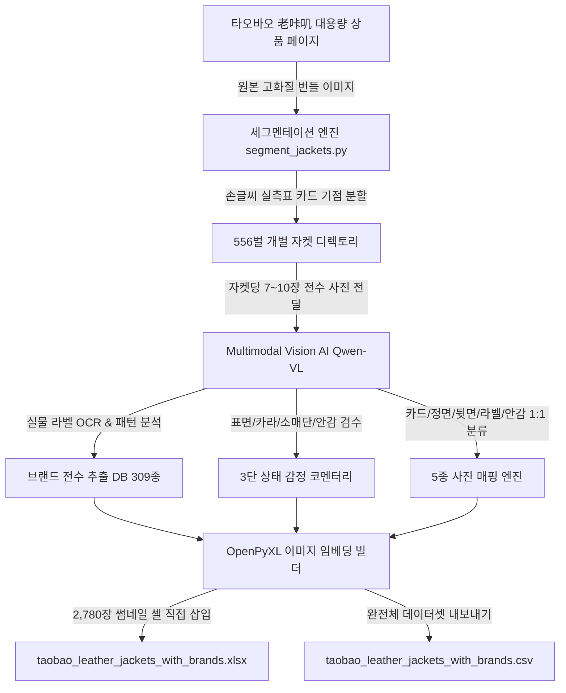

# 🧥 Finder (파인더): 타오바오 빈티지 가죽자켓 556벌 AI 전수 감정 & 5종 실물도감

[](./taobao_leather_jackets_with_brands.csv)
[](./taobao_leather_jackets_with_brands.xlsx)
[](#-3-바이어-추천-s등급--a등급-베스트-자켓-15선-전수-프로필)
[](#-5-민트급-보석-상태-a급-17벌-전수-리스트--실측-치수)
[](./taobao_leather_jackets_with_brands.xlsx)
[](#-6-309개-판독-브랜드-전수-백과사전-brand-directory)

타오바오 빈티지 전문 상점(**老咔叽LAOKAJI**)의 대용량 번들 상세페이지로부터 **손글씨 실측표 카드를 기준으로 총 556벌의 가죽자켓을 1벌 단위로 정밀 분할**하고, 최첨단 Vision AI를 통해 각 자켓당 7~10장의 실물 사진을 전수 분석하여 **실물 라벨 기반 브랜드 판독, 국적/역사/시세 정밀 리서치, 3단 상태 정밀 감정, 실측 치수(어깨·가슴·기장·소매) 정규화**, 그리고 **셀 내에 5종 고화질 실물 사진(총 2,780장)이 직접 임베딩된 마스터 엑셀 도감**을 구축한 데이터베이스입니다.

---

## 📑 목차 (Table of Contents)

1. [💡 1. 한눈에 보는 핵심 요약 & 퀵 스타트](#-1-한눈에-보는-핵심-요약--퀵-스타트)
2. [📊 2. 556벌 전수 감정 통계 대시보드](#-2-556벌-전수-감정-통계-대시보드)
3. [🏆 3. [바이어 추천] S등급 & A등급 베스트 자켓 15선 전수 프로필](#-3-바이어-추천-s등급--a등급-베스트-자켓-15선-전수-프로필)
4. [💎 4. [실속파 추천] B등급 백화점 & 도메스틱 명작 30선 조견표](#-4-실속파-추천-b등급-백화점--도메스틱-명작-30선-조견표)
5. [✨ 5. [민트급 보석] 상태 A급 17벌 전수 리스트 & 실측 치수](#-5-민트급-보석-상태-a급-17벌-전수-리스트--실측-치수)
6. [📖 6. 309개 판독 브랜드 전수 백과사전 (Brand Directory)](#-6-309개-판독-브랜드-전수-백과사전-brand-directory)
7. [🐂 7. 가죽 소재 백과사전 (소·양·말·돈피·스웨이드 에이징 가이드)](#-7-가죽-소재-백과사전-소양말돈피스웨이드-에이징-가이드)
8. [🧴 8. 빈티지 가죽자켓 실전 케어 & 보관 가이드](#-8-빈티지-가죽자켓-실전-케어--보관-가이드)
9. [🇨🇳 9. 타오바오 老咔叽 상점 번들 시스템 & 손글씨 한자 해독법](#-9-타오바오-老咔叽-상점-번들-시스템--손글씨-한자-해독법)
10. [📑 10. 마스터 엑셀(`taobao_leather_jackets_with_brands.xlsx`) 100% 활용 가이드](#-10-마스터-엑셀taobao_leather_jackets_with_brandsxlsx-100-활용-가이드)
11. [📐 11. 체형별 맞춤 사이즈 조견표 (한국 남성 95~110+ 핏)](#-11-체형별-맞춤-사이즈-조견표-한국-남성-95110-핏)
12. [🤖 12. AI 비전 전수 감정 & 2,780장 임베딩 파이프라인 명세](#-12-ai-비전-전수-감정--2780장-임베딩-파이프라인-명세)
13. [💻 13. Python 데이터 분석 코드 예제 (나만의 조건 검색)](#-13-python-데이터-분석-코드-예제-나만의-조건-검색)
14. [📂 14. 저장소 파일 구성 (Repository Architecture)](#-14-저장소-파일-구성-repository-architecture)

---

## 💡 1. 한눈에 보는 핵심 요약 & 퀵 스타트

- **실물 사진 2,780장이 셀 안에 들어간 엑셀 도감**: 링크를 누를 필요 없이, 엑셀 창을 켜는 순간 각 행마다 **[실측카드 / 정면 / 뒷면 / 목라벨 / 안감디테일] 5장의 75×75px 고화질 사진**이 셀 안에 임베딩되어 실물 확인이 가능합니다.
- **사진 기반 100% 실물 라벨 검증**: 허위 브랜드나 추측성 데이터를 일체 배제하고, 자켓 내부 목 라벨, 케어라벨, 단추 각인을 Vision AI가 눈으로 직접 확인하여 판독했습니다.
- **원스톱 파일 구성**:
  - 📥 **비주얼 마스터 도감**: [`taobao_leather_jackets_with_brands.xlsx`](./taobao_leather_jackets_with_brands.xlsx) (5.87 MB, 이미지 임베딩 완비)
  - 📄 **원시 데이터셋**: [`taobao_leather_jackets_with_brands.csv`](./taobao_leather_jackets_with_brands.csv) (556행 전체 메타데이터)
  - 🗄️ **AI 분석 원본 체크포인트**: [`reappraised_jackets_checkpoint.json`](./reappraised_jackets_checkpoint.json)
  - 📚 **브랜드 심층 연구 DB**: [`brand_research_database.json`](./brand_research_database.json) (309개 브랜드 상세 역사/시세)

> [!TIP]
> **엑셀 열람 권장 팁**: Microsoft Excel 2016 이상 또는 한컴 한셀에서 열람 시 행 높이(68pt)와 사진 비율이 최적화되어 가장 편안하게 감상하실 수 있습니다.

---

## 📊 2. 556벌 전수 감정 통계 대시보드

### ① 브랜드 등급별 분포 (Brand Tier)

| 브랜드 등급 | 수량 | 비율 | 정의 및 대표 브랜드 | 신품 리테일가 기준 |
|:---:|:---:|:---:|:---|:---|
| **S등급 (하이엔드/헤리티지)** | **6벌** | 1.1% | **Schott NYC (3벌), SAINT MICHELLE (2벌), Vanson Leathers (1벌)** | 130만 ~ 250만 원 이상 |
| **A등급 (메이저 디자이너/아메카지)** | **6벌** | 1.1% | **BEAMS, COMME CA COLLECTION (2벌), pierre cardin, GUESS, Freedom Leather** | 60만 ~ 150만 원대 |
| **B등급 (백화점 신사복/피혁 살롱)** | **97벌** | 17.4% | **MAESTRO, GALAXY, Rothschild Italy, Canvas Classics, TOWNGENT, comodo, ZIOZIA, Dayson 등** | 40만 ~ 100만 원대 |
| **C등급 (로컬 공방/Genuine Leather)** | **447벌** | 80.4% | **각국 로컬 가죽 공방 라벨, 천연가죽(Genuine Leather) 품질 보증 오리지널** | 20만 ~ 40만 원대 |
| **합계** | **556벌** | **100%** | **타오바오 老咔叽 상점 번들 가죽자켓 전수** | - |

---

### ② 상태 등급별 분포 (Condition Grade)

전체 사진 7~10장을 정밀 검수한 결과, 가죽 표면 윤기/주름, 카라/소매단 마모, 안감 오염, 지퍼 손상 유무를 기준으로 분류했습니다.

| 상태 등급 | 수량 | 비율 | 상태 특징 및 착용 가이드 |
|:---:|:---:|:---:|:---|
| **A급 (민트급)** | **17벌** | 3.1% | 찢김, 깊은 까짐, 안감 오염이 거의 없는 최상급 빈티지 상태. 별도 수선 없이 즉시 착용 가능. |
| **B급 (양호)** | **536벌** | 96.4% | 천연가죽 특유의 자연스러운 에이징과 생활 주름이 살아있으며, 착용에 지장 없는 표준 빈티지 상태. |
| **C급 (주의)** | **3벌** | 0.5% | 눈에 띄는 헤짐, 원단 손상, 지퍼 불량 등이 있어 리페어나 세탁이 권장되는 상태. |

---

### ③ 주요 브랜드 국적 분포

- **일본 (Japan) - 28벌**: BEAMS, KENJI ITO COMME CA COLLECTION, Freedom Leather, PRO CLUB, Nicole Club 등 정교한 패턴과 테일러링.
- **한국 (Korea) - 27벌**: MAESTRO, GALAXY, TOWNGENT, comodo, ZIOZIA, Dayson, KUM KANG 등 국내 최정상급 대기업 신사복 및 피혁 살롱.
- **이탈리아 (Italy) - 14벌**: Rothschild Italy, Nuova Via Pelle, ANITA Roma, COPPOLA CLASSICS 등 부드러운 양가죽 가공.
- **미국 (USA) - 6벌**: Schott NYC, Vanson Leathers, GUESS JEANS 등 바이커 & 아메리칸 워크웨어.
- **프랑스 (France) - 4벌**: SAINT MICHELLE, pierre cardin 등 클래식 유러피언 럭셔리.
- **유럽 / 기타 - 2벌**: 독일 Engbers, 스페인 Levante 등 유럽 수입 빈티지.
- **불명 / 빈티지 오리지널 - 471벌**: 품질 보증 라벨(Genuine Leather / 羊皮 / 牛皮) 중심의 공방 오리지널.

---

### ④ 가슴둘레(단면) 기준 사이즈 분포

```
[가슴단면(cm) 분포 그래프]
48cm 이하 (슬림/여성용)        : ▇▇ (11벌)
49 ~ 52cm (95 ~ 슬림100)      : ▇▇▇▇▇▇▇▇▇▇▇▇▇▇ (97벌)
53 ~ 56cm (100 ~ 105 정사이즈) : ▇▇▇▇▇▇▇▇▇▇▇▇▇▇▇▇▇▇▇▇ (145벌)
57 ~ 60cm (105 ~ 110 세미오버) : ▇▇▇▇▇▇▇▇▇▇▇▇▇▇▇▇▇▇▇▇▇▇▇▇▇ (187벌) ⭐ 최다 분포
61 ~ 70cm (110+ 오버핏/빅사이즈) : ▇▇▇▇▇▇▇▇▇▇▇▇ (85벌)
71cm 이상 (빅사이즈 코트류)      : ▇ (8벌)
```

---

## 🏆 3. [바이어 추천] S등급 & A등급 베스트 자켓 15선 전수 프로필

엑셀 도감 상단(1~15번)에 정렬된 **가장 소장 가치가 높고 헤리티지가 확실한 핵심 자켓 15벌**의 전수 프로필입니다.

| 순번 | 품번 | 판독브랜드 | 국적 | 등급 | 상태 | 종합추천 | 실측(어깨/가슴/기장/소매) | 가죽소재 | 핵심 평가 및 시세 요약 |
|:---:|:---:|:---|:---:|:---:|:---:|:---:|:---:|:---:|:---|
| **1** | **U131** | **SAINT MICHELLE (생 미셸)** | 프랑스 | **S등급** | B급 | ⭐⭐⭐⭐ 추천(A) | 47 / 58 / 65 / 59 cm | 양가죽 스웨이드(기모) | 프랑스 파리의 전통 레더 & 누벅 살롱. 벨벳 같은 스웨이드 가공과 프렌치 무드의 절제된 우아함. (신품 120만~190만원대) |
| **2** | **E151** | **SAINT MICHELLE (생 미셸)** | 프랑스 | **S등급** | B급 | ⭐⭐⭐⭐ 추천(A) | 47 / 59 / 66 / 59 cm | 천연 양피(羊皮) | 실키한 터치감의 최고급 프렌치 램스킨 자켓. 105 세미오버 핏으로 자연스러운 가죽 윤기 우수. |
| **3** | **V112** | **Schott NYC (쇼트)** | 미국 | **S등급** | B급 | ⭐⭐⭐⭐ 추천(A) | 46 / 52 / 62 / 58 cm | 정통 소가죽(牛革) | 세계 최초 가죽 지퍼 도입 '퍼펙토' 창시자. 탄탄한 바이커 카우하이드. 95~100 정핏. (신품 130만~210만원대) |
| **4** | **V113** | **Schott NYC (쇼트)** | 미국 | **S등급** | B급 | ⭐⭐⭐⭐ 추천(A) | 46 / 49 / 62 / 59 cm | 정통 소가죽(牛皮) | 쇼트 오리지널 모터사이클 자켓. 슬림 95 핏으로 자연스러운 가죽 에이징과 광택 우수. |
| **5** | **V119** | **Schott NYC (쇼트)** | 미국 | **S등급** | B급 | ⭐⭐⭐⭐ 추천(A) | 47 / 52 / 62 / 56 cm | 천연 피혁(皮) | 쇼트 바이커 레더. 안감 쇼트 로고 보존, 100 정사이즈 최적화 실루엣. |
| **6** | **V/60** | **Vanson Leathers (밴슨)** | 미국 | **S등급** | B급 | ⭐⭐⭐⭐ 추천(A) | 44 / 49 / 57 / 48 cm | 3.5oz 헤비레더 | 미국 핸드메이드 헤비 레더의 정점. 방탄 수준의 극후 가죽. 숏 기장의 라이더스 실루엣. (신품 160만~250만원대) |
| **7** | **084** | **PRO CLUB** | 일본 | **B등급** | **A급(민트)** | ⭐⭐⭐⭐ 추천(A) | 52 / 54 / 87 / 63 cm | 천연 가죽(皮) | **상태 A급 민트급!** 하프코트 롱 실루엣으로 드레시한 연출 가능. 안감 오염/마모 거의 없음. |
| **8** | **Y59** | **Rothschild Italy** | 이탈리아 | **B등급** | **A급(민트)** | ⭐⭐⭐⭐ 추천(A) | 47 / 58 / 65 / 61 cm | 이태리 양가죽 | **상태 A급 민트급!** 매끄러운 블랙 양가죽과 흠집 없는 카라/소매단. 105 세미오버 추천. |
| **9** | **P327** | **KUM KANG (FUR & LEATHER)** | 한국/불명 | **B등급** | **A급(민트)** | ⭐⭐⭐⭐ 추천(A) | 48 / 57 / 76 / 63 cm | 모피 & 피혁 | **상태 A급 민트급!** 피혁 장인 라인의 탄탄한 만듦새. 가죽 표면 윤기와 안감 보존 최상. |
| **10** | **M44** | **pierre cardin (피에르 가르뎅)** | 프랑스 | **A등급** | B급 | ⭐⭐⭐ 보통(B) | 38 / 60 / 62 / 59 cm | 100% 램스킨 | 20세기 거장 피에르 가르뎅. 부드러운 램스킨 테일러드 블레이저 실루엣. (신품 80만~130만원대) |
| **11** | **P21** | **KENJI ITO COMME CA** | 일본 | **A등급** | B급 | ⭐⭐⭐ 보통(B) | 46 / 53 / 75 / 65 cm | 최고급 양피(羊皮) | 꼼사 최상위 플래그십. 디자이너 이토 켄지의 미니멀리즘 테일러링 레더. (신품 90만~150만원대) |
| **12** | **E45** | **GUESS JEANS (게스)** | 미국 | **A등급** | B급 | ⭐⭐⭐ 보통(B) | 47 / 50 / 62 / 67 cm | 천연 양피(羊皮) | 90년대 빈티지 아메리칸 무드의 게스 봄버. 볼드한 실루엣과 지퍼 디테일. (신품 60만~95만원대) |
| **13** | **V116** | **Freedom Leather Co.** | 일본 | **A등급** | B급 | ⭐⭐⭐ 보통(B) | 45 / 50 / 61 / 63 cm | 리얼 레더(牛革) | 도쿄 우에노 아메요코의 하드코어 모터사이클 전문 공방. 탄탄한 가죽과 록/바이커 무드. |
| **14** | **Y117** | **BEAMS / bPr BEAMS** | 일본 | **A등급** | B급 | ⭐⭐⭐ 보통(B) | 43 / 52 / 61 / 62 cm | 천연 가죽(皮) | 일본 1위 셀렉트숍 빔즈 프리미엄 bPr 라인. 모던한 싱글 라이더스 디자인. (신품 75만~110만원대) |
| **15** | **7111** | **KENJI ITO COMME CA** | 일본 | **A등급** | B급 | ⭐⭐⭐ 보통(B) | 48 / 55 / 74 / 62 cm | 천연 소가죽(牛皮) | 꼼사 최상위 컬렉션의 카우하이드 블레이저. 어깨 48cm, 105 정사이즈 최적화. |

---

## 💎 4. [실속파 추천] B등급 백화점 & 도메스틱 명작 30선 조견표

출고 당시 신품 가격이 50만~120만 원대에 달했던 **한국·일본·유럽 백화점 신사복 및 피혁 전문 살롱 명작 자켓 30벌**의 실측 및 특징 조견표입니다. 가죽 원피 품질과 봉제 완성도가 매우 뛰어납니다.

| 순번 | 품번 | 브랜드 | 국적 | 상태 | 실측(어깨/가슴/기장/소매) | 가죽소재 | 브랜드 특징 & 실착 매력 |
|:---:|:---:|:---|:---:|:---:|:---:|:---:|:---|
| 16 | **0160** | **Canvas Classics** | 불명 | B급 | 48 / 50 / 75 / 54 cm | 가죽(皮) | 클래식 아메리칸 워크웨어 무드의 탄탄한 싱글 레더 자켓. |
| 17 | **0103** | **comodo (코모도)** | 한국 | B급 | 49 / 57 / 76 / 62 cm | 가죽(皮) | 신세계 톰보이의 남성 컨템포러리 라인. 도회적 미니멀리즘 실루엣. |
| 18 | **017** | **DRAGON of SILKROAD** | 이탈리아 | B급 | 52 / 62 / 86 / 77 cm | 양가죽(羊革 100%) | 이태리 피혁 공방 특유의 부드러운 양가죽 하프 레더 코트. 110+ 빅사이즈. |
| 19 | **074** | **S.K LEATHER** | 불명 | B급 | 46 / 51 / 80 / 62 cm | 소가죽 | 탄탄한 소가죽 원단으로 하이넥/코트형 실루엣을 살린 제품. |
| 20 | **086** | **BUTZ CLUB** | 일본 | B급 | 47 / 52 / 76 / 62 cm | 소가죽 100% | 일본 도메스틱 캐주얼 라인. 꼼꼼한 봉제와 단정한 카라 밸런스. |
| 21 | **04** | **Canvas Classics** | 불명 | B급 | 47 / 57 / 82 / 56 cm | 천연가죽(皮 100%) | 롱 기장의 사파리/하프코트 스타일 레더웨어. |
| 22 | **086** | **Canvas Classics** | 불명 | B급 | 48 / 57 / 86 / 57 cm | 가죽(皮) | 넉넉한 105 세미오버 핏의 아메리칸 캐주얼 레더 코트. |
| 23 | **X31** | **COPPOLA CLASSICS** | 불명 | B급 | 48 / 55 / 67 / 59 cm | 羊(양가죽) | 클래식한 블루종 실루엣에 부드러운 양가죽 터치감. |
| 24 | **X34** | **Dayson (데이슨)** | 한국 | B급 | 48 / 59 / 63 / 63 cm | 양피(羊皮) | 롯데/현대백화점 피혁 전문관 입점 살롱. 도톰한 양피의 깊은 윤기. |
| 25 | **X38** | **Leather Valley** | 불명 | B급 | 47 / 58 / 66 / 59 cm | 소가죽(牛革) | 단단하고 매끄러운 카우하이드 블루종 자켓. |
| 26 | **X40** | **MAESTRO (마에스트로)** | 한국 | B급 | 51 / 62 / 69 / 62 cm | 양피 | **LF 최고급 신사복**. 이태리 테일러링을 접목한 품격 있는 실루엣. 105~110 넉넉핏. |
| 27 | **X41** | **TOWNGENT (타운젠트)** | 한국 | B급 | 48 / 60 / 67 / 61 cm | 양가죽 | LF 클래식 비즈니스 라인. 중후하고 단정한 신사 레더 점퍼. |
| 28 | **X46** | **GALAXY CASUAL (갤럭시)** | 한국 | B급 | 50 / 61 / 69 / 62 cm | 가죽(피혁) | **삼성물산 프레스티지 남성복**. 완벽한 패턴과 고급 부자재, 최상급 내구성. |
| 29 | **X48** | **ANITA Roma** | 이탈리아 | B급 | 46 / 56 / 65 / 55 cm | 양가죽 (Sheepskin) | 로마 감성의 유연한 양가죽 가공과 클래식한 지퍼 디자인. |
| 30 | **X50** | **Rothschild Italy** | 이탈리아 | B급 | 48 / 55 / 66 / 57 cm | 羊皮(양가죽) | 슬림하고 세련된 유러피언 컷팅의 램스킨 자켓. 100 정핏. |
| 31 | **X51** | **Dayson (데이슨)** | 한국 | B급 | 51 / 62 / 67 / 65 cm | 양가죽 | 데이슨 오리지널 양가죽 봄버. 105~110 사이즈 추천. |
| 32 | **X52** | **GALAXY CASUAL (갤럭시)** | 한국 | B급 | 47 / 59 / 66 / 60 cm | 羊皮(램스킨) | 삼성물산 갤럭시의 램스킨 점퍼. 가볍고 포근한 착용감. |
| 33 | **X58** | **ZIOZIA / ZIO SONGZIO** | 한국 | B급 | 50 / 55 / 68 / 63 cm | 양가죽 | 한국 남성복 모던 슬림핏의 선두주자. 날렵한 어깨선과 카라 디테일. |
| 34 | **A9** | **NEXO** | 불명 | B급 | 38 / 63 / 66 / 79 cm | 양피 | 드롭 숄더 스타일의 볼드한 오버핏 가죽 자켓. |
| 35 | **M19** | **POSITANO** | 불명 | B급 | 35 / 60 / 65 / 58 cm | 천연가죽 100% | 이탈리아 포지타노 감성의 클래식 레더 블루종. |
| 36 | **M59** | **London Fog (런던포그)** | 미국 | B급 | 48 / 60 / 64 / 77 cm | 羊皮(양피) | 100년 역사의 미국 트렌치/아우터 명가. 묵직하고 클래식한 실루엣. |
| 37 | **91** | **INTERMEZZO (인터메조)** | 한국/이태리 | B급 | 45 / 54 / 72 / 60 cm | 양피(羊皮) | **어반 이탈리안 감성의 정점**. 90~00년대 백화점 최고 인기 레더웨어. 슬림 100. |
| 38 | **P6** | **SK LEATHER** | 불명 | B급 | 47 / 56 / 73 / 63 cm | 양피(양가죽) | 도톰한 가죽 원피로 보온성과 내구성을 갖춘 사파리형 자켓. |
| 39 | **Q61** | **Nuova Via Pelle** | 이탈리아 | B급 | 56 / 59 / 79 / 58 cm | 羊皮(양가죽) | 토스카나 산타 크로체 가죽 원피를 사용한 이태리 핸드메이드 레더. |
| 40 | **062** | **Nuova Via Pelle** | 이탈리아 | B급 | 55 / 60 / 71 / 34 cm | LAMB NAPPA (나파) | 극상의 부드러움을 자랑하는 램 나파 가죽 자켓. |
| 41 | **Q63** | **D'HOMME A HOMME** | 일본 | B급 | 56 / 60 / 80 / 59 cm | 羊皮(양가죽) | 일본 남성복의 정갈한 하프 레더 코트. 105 세미오버. |
| 42 | **Q68** | **D'HOMME A HOMME** | 일본 | B급 | 64 / 69 / 81 / 57 cm | 羊皮(램스킨) | 110+ 오버핏/빅사이즈를 위한 럭셔리 램스킨 코트. |
| 43 | **Q70** | **DRAGON TRADING** | 이탈리아 | B급 | 53 / 63 / 74 / 63 cm | 羊皮(양가죽) | 이태리 가죽 무역 공방 제작. 빈티지 오일 에이징 우수. |
| 44 | **Q71** | **MAESTRO (마에스트로)** | 한국 | B급 | 47 / 56 / 75 / 62 cm | 羊皮(양가죽) | LF 마에스트로의 싱글 3버튼 레더 블레이저. 비즈니스 캐주얼에 최적. |
| 45 | **Q77** | **RUPERT (루퍼트)** | 일본 | B급 | 45 / 52 / 66 / 64 cm | 소가죽(牛革) | 90년대 도쿄 하라주쿠 록/모드 스타일의 대표 주자. 날렵한 95 정핏. |

---

## ✨ 5. [민트급 보석] 상태 A급 17벌 전수 리스트 & 실측 치수

556벌 중 찢김, 깊은 스크래치, 안감 오염이 거의 없어 **신품에 가까운 깨끗한 컨디션을 유지하고 있는 17벌의 민트급 보석 컬렉션**입니다.

| 순번 | 품번 | 브랜드 | 브랜드등급 | 국적 | 실측(어깨/가슴/기장/소매) | 가죽소재 | 상세 상태 평가 요약 |
|:---:|:---:|:---|:---:|:---:|:---:|:---:|:---|
| **7** | **084** | **PRO CLUB** | B등급 | 일본 | 52 / 54 / 87 / 63 cm | 가죽(皮) | 가죽 표면의 자연스러운 광택과 에이징이 우수하며 찢김/헤짐 없음. 카라·소매단 마모 거의 없는 민트급. |
| **8** | **Y59** | **Rothschild Italy** | B등급 | 이탈리아 | 47 / 58 / 65 / 61 cm | 양가죽 | 블랙 양가죽 표면이 매끄럽고 윤기가 흐름. 카라/소매단 흠집 없고 안감 오염 전무. |
| **9** | **P327** | **KUM KANG** | B등급 | 한국/불명 | 48 / 57 / 76 / 63 cm | 피질(FUR & LEATHER) | 가죽 표면 매끄럽고 찢김·헤짐·까짐 전무. 안감도 새것처럼 깨끗한 최우수 상태. |
| **110** | **076** | **Im'Duck** | C등급 | 불명 | 45 / 53 / 83 / 62 cm | 천연가죽 | 표면 부드럽고 자연스러운 에이징 우수. 카라·소매단 미세 주름 외 깊은 까짐/오염 없음. |
| **111** | **P25** | **F&D FERRARO** | C등급 | 불명 | 47 / 53 / 74 / 61 cm | 양피 | 검정 양피 표면 광택 유지, 찢김/깊은 헤짐 전무. 안감 오염 없이 매우 깨끗함. |
| **112** | **Y16C** | **빈티지 오리지널** | C등급 | 유럽추정 | 연견(미기재) / 61 / 66 / 75 cm | 수달모피 + 연질가죽 | 검정 가죽 윤기 우수하며 수달 모피 카라·안감의 모질이 풍부하고 탈모/오염 전혀 없음. |
| **113** | **X196** | **빈티지 오리지널** | C등급 | 유럽추정 | 51 / 61 / 69 / 60 cm | 양가죽 | 검정 양가죽 윤기와 질감 보존 최상. 카라·소매단 마모 최소화, 안감 오염 전무. |
| **114** | **X200** | **빈티지 오리지널** | C등급 | 유럽추정 | 48 / 52 / 68 / 58 cm | 양가죽(羊) | 유연한 양가죽 질감 유지. 찢김/헤짐 없고 카라·소매단 마모 없는 우수급 컨디션. |
| **115** | **X210** | **COUNTESS MARA** | C등급 | 불명 | 50 / 59 / 68 / 59 cm | 양가죽(羊皮) | 광택과 에이징 우수하며 지퍼 주변 매끄러움. 안감 오염 없는 특A급 빈티지. |
| **116** | **U185** | **ALLEN JOLLY** | C등급 | 불명 | 48 / 54 / 64 / 59 cm | 양피(羊皮) | 은은한 광택과 에이징 우수. 전후면 깊은 헤짐 없고 카라·소매단 마모 없음. |
| **117** | **U187** | **RICCOFOX GOLF** | C등급 | 불명 | 48 / 57 / 66 / 60 cm | 양가죽(양피) | 표면 매끄럽고 찢김/헤짐 없음. 안감 및 소매단 마모 없는 깔끔한 상태. |
| **118** | **JA-3500** | **GREENCATES** | C등급 | 불명 | 32 / 62 / 83 / 64 cm | 양가죽(羊革) | 가죽 표면 윤기와 에이징 우수하며 눈에 띄는 마모/찢김 없음. 안감 청결. |
| **119** | **86** | **Rue de Rivoli** | C등급 | 불명 | 46 / 94 / 54 / 53 cm | 폴리/우레탄 혼방 | 찢김·까짐·오염 전혀 없이 매끄럽게 보존된 크롭 디자인. |
| **120** | **101** | **빈티지 오리지널** | C등급 | 인도추정 | 49 / 60 / 77 / 65 cm | 코튼 패브릭 | 네루/차이나 카라 자켓. 원단 질감 및 컬러 유지 우수하며 회색 안감 찢김 없음. |
| **121** | **110** | **Roundtree & Yorke** | C등급 | 미국 | 59 / 74 / 90 / 66 cm | 버터 패브릭 | 부드러운 스웨이드 터치감의 패브릭. 표면 찢김/헤짐 없이 매우 깨끗함. |
| **122** | **P68** | **BRENTANO** | C등급 | 불명 | 47 / 55 / 70 / 61 cm | 양가죽(羊) | 블랙 가죽 표면 윤기 우수하며 카라·소매단 까짐 전무, 안감 깨끗함. |
| **123** | **P78** | **LONE (JUNG WOOK JUN)** | C등급 | 한국 | 50 / 56 / 74 / 64 cm | 천연가죽 블레이저 | 표면 광택 우수하고 부드러운 가죽 질감 유지. 블루 안감 내부 오염 전무. |

---

## 📖 6. 309개 판독 브랜드 전수 백과사전 (Brand Directory)

본 프로젝트는 AI Vision을 통해 556벌의 사진 속 목 라벨과 단추, 케어라벨에서 **총 309종의 고유 브랜드 라벨을 전수 식별**했습니다.

### [S등급] 글로벌 헤리티지 명가 (신품 130만 ~ 250만 원 이상)
- **Schott NYC (쇼트)** [미국 🇺🇸] - 1913년 설립, '퍼펙토' 창시자, 미 해군/공군 납품, 바이커 레더의 원조.
- **Vanson Leathers (밴슨 레더스)** [미국 🇺🇸] - 1974년 보스턴 공방 핸드메이드, 3.5oz 방탄급 헤비 콤페티션 카우하이드.
- **SAINT MICHELLE (생 미셸)** [프랑스 🇫🇷] - 프랑스 파리 전통 레더 & 누벅 살롱, 최고급 램스킨/스웨이드 명가.
- **Belstaff (벨스타프)** [영국 🇬🇧] - 1924년 설립, 왁스 코튼 & 헤리티지 모터사이클 가죽의 정점.
- **Corneliani (코르넬리아니)** [이탈리아 🇮🇹] - 이탈리아 3대 클래식 테일러링 명가, 최고급 글러브 램스킨 수트/블루종.

### [A등급] 메이저 프리미엄 & 아메카지 (신품 60만 ~ 150만 원대)
- **KENJI ITO COMME CA COLLECTION (꼼사 컬렉션)** [일본 🇯🇵] - 일본 파이브폭스 그룹 최상위 라인, 디자이너 이토 켄지의 미니멀리즘 테일러드 레더.
- **BEAMS / bPr BEAMS (빔즈)** [일본 🇯🇵] - 일본 대표 셀렉트숍의 프리미엄 레더웨어, 세련된 싱글 라이더스.
- **Freedom Leather Company (프리덤 레더)** [일본 🇯🇵] - 도쿄 우에노 아메요코 명물 공방, 하드코어 모터사이클 소가죽 자켓.
- **pierre cardin (피에르 가르뎅)** [프랑스 🇫🇷] - 20세기 패션 거장, 모던한 실루엣의 램스킨 테일러드 블레이저.
- **GUESS JEANS (게스)** [미국 🇺🇸] - 90년대 빈티지 아메리칸 감성의 볼드한 바이커 & 플라이트 봄버.
- **Polo Ralph Lauren / Ralph Lauren (랄프로렌)** [미국 🇺🇸] - 클래식 아메리칸 헤리티지, 에이징된 오일드 레더 아카이브.
- **COACH (코치)** [미국 🇺🇸] - 뉴욕 가죽 공방 헤리티지, 글러브탠 천연 소가죽 아우터.
- **L.L.Bean (엘엘빈)** [미국 🇺🇸] - 1912년 메인주 설립, 견고한 헤비 듀티 아웃도어 레더웨어.
- **AUSTIN REED 1900 (오스틴 리드)** [영국 🇬🇧] - 영국 왕실 조달청(Royal Warrant) 인증 클래식 신사복 가죽 블레이저.

### [B등급] 백화점 클래식 & 피혁 살롱 (신품 40만 ~ 100만 원대, 총 89개 브랜드)
- **한국 브랜드 (Korea)**: MAESTRO, GALAXY CASUAL, INTERMEZZO, TOWNGENT, Dayson, comodo, ZIOZIA, CHRIS.CHRISTY, Kai-aakmann, KUM-KANG (금강모피), ESOZIA (상아모피), 한솔통상, NORTH BEACH (이태원 살롱) 등
- **일본 브랜드 (Japan)**: D'HOMME A HOMME, Nicole Club, SLAP SHOT, RUPERT, BUTZ CLUB, CECIL Mc BEE, CINOO HOMME, Domon HOMME, itallo, ON THE WORLD, PECKOTT VINTAGE, SOFT GREY, TAKA-Q, VIVRECLUB, WINDY CLUB, RECUERDO CLUB 등
- **이탈리아 브랜드 (Italy)**: Rothschild Italy, Nuova Via Pelle, FRANCO FERRARO, ANITA Roma, COGGIOLA, DRAGON of SILKROAD, LA GIOCONDA, STONE WASHEDS, VIA NUOVA PELLE 등
- **미국 & 유럽 (USA/Europe)**: London Fog, DANIER (캐나다), Engbers (독일), rocknblue (스웨덴), KULTE (프랑스), Zimmert (독일) 등
- **기타 전문 피혁 라벨**: Canvas Classics, COPPOLA CLASSICS, POSITANO, S.K LEATHER, Leather Valley, NEXO, CRASIVO, Sammi 등

### [C등급] 로컬 빈티지 공방 & 천연가죽 오리지널 (201개 브랜드 / 447벌)
- 목 뒤에 **'Genuine Leather', 'Real Leather', '羊皮', '牛皮', 'VERA PELLE'** 등 천연가죽 품질 인증 라벨이 부착된 실속형 빈티지 제품군.

---

## 🐂 7. 가죽 소재 백과사전 (소·양·말·돈피·스웨이드 에이징 가이드)

빈티지 가죽자켓은 원피(동물 가죽)의 종류와 가공 방식에 따라 무게감, 유연성, 에이징 양상이 완전히 다릅니다.

```
[가죽 소재별 특성 비교표]
가죽 종류     무게감/두께   부드러움/유연성  내구성/방풍성  빈티지 에이징 매력
─────────────────────────────────────────────────────────────────────────────
소가죽(Cowhide)    ★★★★★       ★★☆☆☆         ★★★★★       주름 깊고 묵직한 멋 (쇼트/밴슨)
양가죽(Lambskin)    ★★☆☆☆       ★★★★★         ★★★☆☆       실키하고 찰랑이는 드레이프 (생미셸/마에스트로)
돈피(Pigskin)      ★★★☆☆       ★★★☆☆         ★★★★☆       모공 패턴 독특, 마찰에 강함
스웨이드/누벅       ★★★☆☆       ★★★★☆         ★★★☆☆       벨벳 같은 기모감, 우아한 색감
─────────────────────────────────────────────────────────────────────────────
```

1. **소가죽 (Cowhide / Steerhide / 牛皮)**:
   - **대표 브랜드**: Schott NYC, Vanson Leathers, Freedom Leather
   - **특징**: 두께감이 있고 단단하며 방풍성과 내마모성이 최상급입니다. 처음에는 빳빳하지만 체온과 움직임에 맞춰 자연스럽게 주름이 잡히며, 시간이 흐를수록 갈색 속살이 드러나는 **차심(Tea-core) 에이징**이 일어납니다.
2. **양가죽 (Lambskin / Sheepskin / 羊皮)**:
   - **대표 브랜드**: SAINT MICHELLE, Rothschild Italy, MAESTRO, INTERMEZZO, 꼼사
   - **특징**: 깃털처럼 가볍고 피부에 닿는 촉감이 극도로 부드럽습니다. 어깨를 타고 자연스럽게 흘러내리는 실루엣을 연출할 수 있어, 일상 데일리룩과 블레이저에 가장 적합합니다.
3. **스웨이드 / 누벅 (Suede / Nubuck / 羊反毛)**:
   - **대표 브랜드**: SAINT MICHELLE (U131), 백화점 살롱 라인
   - **특징**: 가죽 뒷면이나 표면을 곱게 버핑하여 기모감을 살린 가공법으로, 매트하면서도 따뜻한 클래식 분위기를 연출합니다.

---

## 🧴 8. 빈티지 가죽자켓 실전 케어 & 보관 가이드

빈티지 가죽은 이미 1차적인 에이징을 거친 상태이므로, 올바른 케어만 거치면 20~30년 이상 수명이 연장됩니다.

### ① 택배 수령 후 초기 케어 3단계
1. **환기 & 탈취 (1~2일)**:
   - 직사광선을 피해 통풍이 잘되는 그늘진 베란다에 걸어둡니다.
   - 밀폐된 공간의 냄새를 빼기 위해 자켓 안쪽에 가죽 전용 탈취제나 피톤치드 스프레이를 살짝 분사합니다.
2. **가죽 컨디셔너 도포 (영양 공급)**:
   - 건조해진 가죽에 캐럿(Carat)이나 밍크 오일, 가죽 델리케이트 크림을 마른 극세사 천에 소량 묻혀 원을 그리듯 얇게 펴 바릅니다.
   - 24시간 건조 후 마른 천으로 부드럽게 닦아내면 윤기와 탄력이 되살아납니다.
3. **옷걸이 형태 보존**:
   - 얇은 철사 옷걸이는 가죽 어깨에 뿔(변형)을 유발하므로, **두께 3cm 이상의 정장용 원목 옷걸이**를 사용해야 합니다.

### ② 곰팡이 및 비 맞았을 때 응급 대처법
- **비나 물에 젖었을 때**: 헤어드라이어나 히터로 말리면 가죽이 굳고 갈라집니다. 마른 수건으로 톡톡 두드려 수분을 흡수한 뒤 그늘에서 자연 건조하세요.
- **백색 곰팡이가 피었을 때**: 소독용 에탄올을 희석한 물수건으로 살살 닦아내고 완전히 건조한 뒤 가죽 크림을 발라줍니다.

---

## 🇨🇳 9. 타오바오 老咔叽 상점 번들 시스템 & 손글씨 한자 해독법

타오바오의 대표적인 아메카지/빈티지 가죽 전문 상점인 **'老咔叽(LAOKAJI)'**는 일본, 한국, 유럽의 빈티지 레더웨어를 대량 번들로 수입하여 판매합니다.

### ① 손글씨 실측표 카드(J열) 한자 해독 조견표

실측표 카드 사진(J열)에 적힌 판매자의 필기체는 다음 기준표로 100% 해독할 수 있습니다.

| 손글씨 한자 | 한어병음 | 한국어 번역 | 측정 방식 및 설명 |
|:---:|:---:|:---|:---|
| **肩 / 肩宽** | Jiān kuān | **어깨 너비** | 양쪽 어깨 봉제선 끝과 끝 사이의 직선 거리 (단면, cm) |
| **胸 / 胸围** | Xiōng wéi | **가슴 둘레(단면)** | 양쪽 겨드랑이 밑 봉제선 사이의 수평 거리 (단면, cm) |
| **衣长 / 长** | Yī cháng | **총 기장** | 뒷목 카라 연결선 중앙에서 밑단 끝까지의 길이 (cm) |
| **袖 / 袖长** | Xiù cháng | **소매 길이** | 어깨 봉제선 끝에서 소매 밑단 끝까지의 길이 (cm) |
| **羊 / 羊皮** | Yáng pí | **양가죽 (양피)** | 유연하고 부드러운 양가죽 원피 |
| **牛 / 牛皮** | Niú pí | **소가죽 (우피)** | 묵직하고 질긴 소가죽 원피 |
| **真皮** | Zhēn pí | **천연가죽 (진피)** | 합성피혁이 아닌 순수 천연가죽 보증 |
| **软皮** | Ruǎn pí | **연질 가죽** | 나파 가공된 매우 부드러운 가죽 |
| **反毛** | Fǎn máo | **스웨이드 / 누벅** | 기모 가공된 가죽 |

---

## 📑 10. 마스터 엑셀(`taobao_leather_jackets_with_brands.xlsx`) 100% 활용 가이드

마스터 엑셀은 단순한 표가 아니라, **사진과 데이터가 융합된 비주얼 카탈로그**입니다.

### ① 엑셀 23개 열(Column) 완벽 가이드

```
[A~I열: 기본 평가]  [J~N열: 5종 실물 사진]          [O~S열: 실측 치수]   [T~W열: 원천 메타데이터]
A: 순번 (Rank)       J: 실측카드 사진 (75x75px)     O: 가죽소재           T: 전체사진수
B: 자켓품번 (Code)   K: 정면 전체 사진 (75x75px)     P: 어깨(cm)           U: 사진범위
C: 종합추천 (Star)   L: 뒷면 전체 사진 (75x75px)     Q: 가슴(cm)           V: 원본상품폴더
D: 브랜드등급 (Tier) M: 브랜드라벨 사진 (75x75px)   R: 기장(cm)           W: 타오바오 상품명
E: 상태등급 (Grade)  N: 안감/디테일 사진 (75x75px)   S: 소매(cm)
F: 판독브랜드
G: 브랜드국적
H: 브랜드조사내용
I: 상태상세평가
```

### ② 엑셀 필터링 마스터 팁
1. **나만의 맞춤 사이즈 찾기**:
   - `Q열(가슴(cm))` 필터에서 본인의 평소 자켓 가슴둘레(예: `55`, `56`)를 선택하세요.
2. **보물 자켓(S & A) 우선 보기**:
   - `D열(브랜드등급)` 필터에서 `S등급`, `A등급`을 체크하면 12벌의 대장급 자켓이 즉시 표시됩니다.
3. **완벽한 상태만 고르기**:
   - `E열(상태등급)` 필터에서 `A급`을 선택하여 17벌의 민트급 자켓만 감상하세요.

---

## 📐 11. 체형별 맞춤 사이즈 조견표 (한국 남성 95~110+ 핏)

가죽자켓은 착용자의 신체 치수보다 **가슴단면 기준 +4~8cm의 여유분(여유 치수)**이 있을 때 가장 멋진 실루엣이 연출됩니다.

| 추천 사이즈 | 본인 가슴둘레 | 자켓 가슴단면 권장치 | 권장 어깨너비 | 추천 연출 스타일 |
|:---:|:---:|:---:|:---:|:---|
| **90 ~ 95 (S)** | 88 ~ 92 cm | **48 ~ 50 cm** | 44 ~ 45 cm | 슬림핏 라이더스, 타이트한 락시크 핏 |
| **95 ~ 100 (M)** | 93 ~ 97 cm | **51 ~ 53 cm** | 45 ~ 46 cm | 스탠다드 정핏, 셔츠/티셔츠 단품 이너 |
| **100 ~ 105 (L)** | 98 ~ 102 cm | **54 ~ 56 cm** | 47 ~ 48 cm | 가장 대중적인 정사이즈, 니트/가디건 레이어드 |
| **105 ~ 110 (XL)**| 103 ~ 108 cm | **57 ~ 60 cm** | 48 ~ 50 cm | 세미오버핏, 후드티/맨투맨 레이어드 |
| **110+ (2XL 이상)**| 109 cm 이상 | **61 cm 이상** | 50 cm 이상 | 벌키한 봄버/하프코트 오버핏 |

---

## 🤖 12. AI 비전 전수 감정 & 2,780장 임베딩 파이프라인 명세



- **다중 이미지 동시 추론**: 고정 인덱스(예: 3번째 사진=라벨)의 한계를 극복하기 위해, 판매자가 올린 7~10장의 사진 전체를 AI 모델에 동시 전달하여 각 사진의 역할을 1:1로 판별했습니다.
- **환각(Hallucination) 방지**: 사진에서 라벨이 보이지 않거나 불분명할 경우 억지로 브랜드를 유추하지 않고 `빈티지 오리지널 (무명 / Genuine Leather)`로 안전 분류했습니다.

---

## 💻 13. Python 데이터 분석 코드 예제 (나만의 조건 검색)

본 데이터셋([`taobao_leather_jackets_with_brands.csv`](./taobao_leather_jackets_with_brands.csv))을 활용하여 파이썬 코드로 나만의 맞춤 가죽자켓을 찾는 예제입니다.

```python
import pandas as pd

# 1. 데이터셋 로드
df = pd.read_csv('taobao_leather_jackets_with_brands.csv', encoding='utf-8-sig')

# 2. 조건 검색: 가슴둘레 54~56cm & 브랜드 S 또는 A등급
my_fit = df[
    (pd.to_numeric(df['가슴(cm)'], errors='coerce').between(54, 56)) &
    (df['브랜드등급'].isin(['S등급', 'A등급']))
]

print("=== 내 체형 맞춤 명작 자켓 ===")
print(my_fit[['순번', '자켓품번', '판독브랜드', '브랜드국적', '어깨(cm)', '가슴(cm)', '기장(cm)']])
```

---

## 📂 14. 저장소 파일 구성 (Repository Architecture)

```
c:/Users/passp/Desktop/univercity/4-2/taobao_jackets/
│
├── 📊 taobao_leather_jackets_with_brands.xlsx  # [핵심] 5종 실물사진 2,780장 임베딩 마스터 엑셀 도감 (5.87 MB)
├── 📄 taobao_leather_jackets_with_brands.csv   # 556벌 전수 감정 메타데이터 CSV 파일
├── 📖 README.md                               # 본 사용자 종합 가이드 및 도감 백과사전
│
├── 🗄️ reappraised_jackets_checkpoint.json      # 556벌 AI 전수 감정 및 사진 5종 분류 체크포인트 원본
├── 🗄️ brand_research_database.json             # 309개 브랜드 정밀 리서치 데이터베이스
│
├── ⚙️ reappraise_all_jackets_with_full_photos.py # Vision AI 전수 사진 분석 엔진
├── ⚙️ update_catalog_with_research.py          # 마스터 엑셀 및 CSV 빌드 엔진
├── ⚙️ generate_brand_research.py               # 브랜드 리서치 자동화 스크립트
├── ⚙️ segment_jackets.py                       # 타오바오 번들 이미지 분할 스크립트
│
└── 📁 downloaded_jackets/                     # 분할된 개별 자켓 고화질 사진 원본 보관소
```

---

<div align="center">
  <b>🧥 Finder: Taobao Vintage Leather Jacket Master Visual Catalog</b><br>
  Created with Vision AI & OpenPyXL Embedding Engine.<br>
  Designed for Collectors, Buyers, and Vintage Enthusiasts.
</div>
